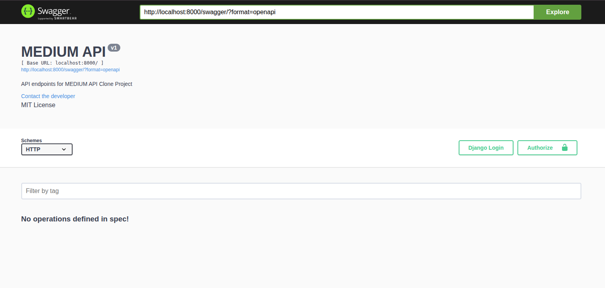
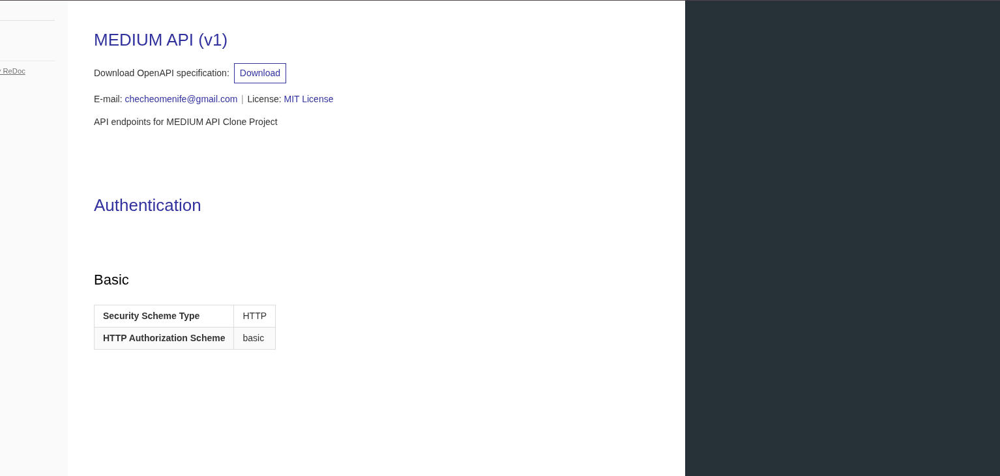

# Medium API Clone


A production-ready Medium API clone built with Django and Docker.

## Features

- User authentication & registration
- CRUD operations for articles, profiles, bookmarks, ratings, and responses
- Password reset & email verification
- Search functionality
- Swagger & ReDoc API documentation
- Fully modular and extendable
- Dockerized for easy setup

## Demo

  


## Installation

Clone the repository:

```bash
git clone https://github.com/your-username/medium-api-clone.git
cd medium-api-clone
Set up environment variables (create a .env file).

Run with Docker:

bash
Copy code
docker compose -f local.yml up --build
Apply migrations:

bash
Copy code
docker compose -f local.yml run --rm api python manage.py makemigrations
docker compose -f local.yml run --rm api python manage.py migrate
Create superuser (admin):

bash
Copy code
docker compose -f local.yml run --rm api python manage.py createsuperuser
Access
Admin panel: http://localhost:8000/supersecret/

Swagger docs: http://localhost:8000/swagger/

ReDoc docs: http://localhost:8000/redoc/

License
This project is licensed under the MIT License.

